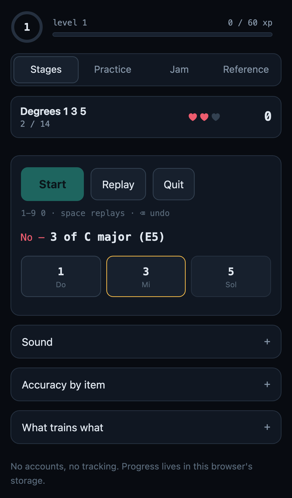

# Perfect Ear

Free, open-source ear training that runs entirely in your browser and keeps working
offline. Spanish-first with fixed-do names (Do Re Mi), English available.

**Try it:** https://wero1414.github.io/ear-training/



**What it does not do:** no accounts, no tracking, no cloud sync, no ads, no subscription.
Everything stays on your device.

## What it trains

- A 43-stage ladder: pitch, intervals, chords and inversions, scale degrees in a key,
  cadences, progressions, melodic dictation, scales and modes.
- Practice mode with every drill kind and its settings.
- A jam loop with chord-tone highlighting and MIDI export: improvise over a
  progression and check yourself against the chord.
- Accuracy per item, with weak items drilled more often.

All sound is synthesised in the browser; there are no audio files.

## Experimental features

Settings has an *Experimental* panel with features that are still being tuned: musical
melodies and minor/modal progressions, spaced repetition (SM-2) with a daily review,
MIDI keyboard input (browsers with Web MIDI; not Safari), quizzes inside the jam loop,
and singing your answers.

**Microphone:** singing answers uses your microphone only to detect the pitch you sing.
The signal is analysed on your device, frame by frame, and is never recorded, stored or
sent anywhere. The app asks for the microphone only after you choose to sing, releases
it when you leave the drill, and works fully without it.

## Install it as an app

**iPhone / iPad (Safari):** open the link, tap Share, then *Add to Home Screen*. Open it
once while online; after that it works in airplane mode.

**Android (Chrome):** open the link, tap the menu, then *Install app* (or *Add to Home
screen*).

Progress lives in the browser's storage on that device. An installed app on iOS keeps
its own storage, separate from Safari: progress made in the browser tab does not appear
in the installed app. Use *Export progress* to keep a copy.

## Development

No build step: the site is plain ES modules served as they are. Node is only needed for
the tests.

```
npm ci
npm run serve        # http://localhost:4173/ear-training/
npm run lint
npm test             # unit tests, then browser tests
```

See [CONTRIBUTING.md](CONTRIBUTING.md) for the rules, and `CLAUDE.md` for the
architecture and test notes.

## License

MIT, see [LICENSE](LICENSE).
